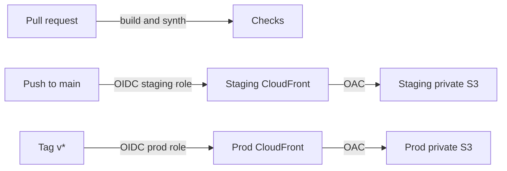

# Deploy

Fluid Tetris is a static Vite app. Hosting is two copies of the same pattern: a private S3 bucket and a CloudFront distribution with Origin Access Control. There is no third dev stack, and Amplify is not used.

`npm run build` already emits a site that works at `/`. `vite.config.ts` keeps `base: './'`, which resolves correctly for `/` and `/index.html`. Game balance and visuals are not part of this setup.

## Staging and prod

Staging is where balance and visual tuning is reviewed. Production changes only when someone tags a commit.

| | Staging | Production |
| --- | --- | --- |
| When it updates | Push to `main`, or `workflow_dispatch` while `main` is selected | Push of a tag that starts with `v` (`v1.2.0`, `v1.2.0-rc.1`) |
| What does not update it | Pull requests, other branches, tags | Pushes to `main`, pull requests, manual dispatch |
| Deploy role | `fluid-tetris-github-deploy-staging` | `fluid-tetris-github-deploy-prod` |
| Role trust | `repo:HyungSeokSeo1122/fluid-tetris:ref:refs/heads/main` | `repo:HyungSeokSeo1122/fluid-tetris:ref:refs/tags/v*` |
| Bucket on stack delete | Deleted with its objects | Kept. Empty it yourself before deleting the bucket |
| URL | `FluidTetrisStaging` output `SiteUrl` | `FluidTetrisProd` output `SiteUrl` |

There is no long-lived `staging` branch. `main` is the staging source, so a merged pull request is the preview designers and LD open. Prod stays on the last tagged build until the next tag. Limit who can push `v*` tags in the GitHub rulesets. That is the prod gate. A manual dispatch cannot publish prod.

Pull requests run `build` and `synth` only. They do not assume a role and do not upload.

`job_workflow_ref` is not in the trust policy. GitHub sets that claim for reusable workflows, and the deploy job lives in `.github/workflows/deploy.yml` rather than a reusable workflow. Requiring the claim would reject the real token. Each role is already limited by the `sub` claim to one ref shape, and its IAM policy can write only that environment's bucket.

## Architecture



Both environments:

- The bucket blocks all public access, denies non-TLS requests, and uses SSE-S3. CDK names the buckets so the two names cannot collide.
- CloudFront uses Origin Access Control. The bucket policy allows `s3:GetObject` and `s3:ListBucket` only from that distribution. `defaultRootObject` is `index.html`, so `/` does not list the bucket.
- Custom error responses map **403** and **404** to `/index.html` with status **200** and a zero cache TTL.
- HTML uses `CachingDisabled`. `/assets/*` uses `CachingOptimized`. The publish step uploads hashed files first, then `index.html` last with `no-cache`.
- The distribution uses the default `*.cloudfront.net` certificate and redirects HTTP to HTTPS. That certificate's TLS policy is AWS-managed. Price class is `PriceClass_200`. HTTP/2 and HTTP/3 are on. Access logs and WAF are off.
- The stack region defaults to `ap-northeast-2` in `infra/cdk.json`. CloudFront is global; both buckets are created in that region.

One shared stack, `FluidTetrisOidc`, creates the GitHub OIDC provider. An account can only have one provider for `token.actions.githubusercontent.com`.

## How designers use staging

1. Open a pull request with the tuning change. Confirm the checks passed. Nothing is published yet.
2. Merge to `main`. The `deploy-staging` job runs only when `github.ref` is `refs/heads/main`.
3. Open the staging `SiteUrl` from the `FluidTetrisStaging` stack. Bookmark it. The hostname does not change on later deploys. The Actions summary repeats that reminder.
4. When that commit should be the locked build, tag it and push the tag:

```bash
git tag v1.2.0
git push origin v1.2.0
```

5. The `deploy-prod` job runs only for a `push` whose ref starts with `refs/tags/v`. Players keep using the prod `SiteUrl`.

`workflow_dispatch` republishes whatever is on the selected ref. Choose `main` to republish staging. Any other ref is skipped. It never publishes prod.

## Cost

Ballpark after the CloudFront free tier, not a quote. The free tier is per account (1 TB out and 10 million HTTP/HTTPS requests per month for the first 12 months), shared by both distributions.

A quiet staging site plus a low-traffic prod site is still typically about **$1–5 per month** once that tier ends. Staging traffic from a few reviewers is cents. There is no NAT gateway, load balancer, or WAF.

## Dry run without AWS credentials

```bash
cd infra
npm ci
CDK_DEFAULT_ACCOUNT=000000000000 npm run check
```

`npm run check` typechecks the app, synthesizes all three stacks, and asserts both sites (private buckets, OAC, SPA errors, cache policies, separate OIDC trusts, Seoul region). It does not call AWS. Do not `cdk deploy` the `000000000000` templates.

`npm run check` expects the defaults in `infra/cdk.json`, which synthesize staging and prod together. To preview one environment or another region, synthesize without the assertions:

```bash
npx cdk synth -c env=staging
npx cdk synth -c region=eu-west-1
```

## Bootstrap once

Use an AWS principal that can bootstrap CDK and create S3, CloudFront, IAM, and CloudFormation resources. That is a one-time human deploy, not a GitHub secret.

```bash
export CDK_DEFAULT_ACCOUNT=$(aws sts get-caller-identity --query Account --output text)

cd infra
npm ci
npx cdk bootstrap "aws://${CDK_DEFAULT_ACCOUNT}/ap-northeast-2"
npx cdk deploy --all
```

`--all` creates `FluidTetrisOidc`, `FluidTetrisStaging`, and `FluidTetrisProd`. To update one site later:

```bash
npx cdk deploy -c env=staging
npx cdk deploy -c env=prod
```

`-c env=` still includes the OIDC stack when this app owns the provider. The bucket region is the `region` context value. Bootstrap that same region. `cdk deploy --region` and `CDK_DEFAULT_REGION` do not move these stacks. Another region:

```bash
npx cdk bootstrap "aws://${CDK_DEFAULT_ACCOUNT}/eu-west-1"
npx cdk deploy --all -c region=eu-west-1
```

If the account already has a GitHub OIDC provider, do not create a second one:

```bash
npx cdk deploy --all \
  -c githubOidcProviderArn=arn:aws:iam::123456789012:oidc-provider/token.actions.githubusercontent.com
```

Another repository is `-c githubRepo=owner/name` before the first deploy. Each role can list and write only its own bucket and can invalidate only its own distribution.

## GitHub variables

No long-lived AWS keys. Add **Variables** (Settings → Secrets and variables → Actions → Variables), not secrets. Names are `AWS_<ENV>_<FIELD>`:

| Variable | Stack output |
| --- | --- |
| `AWS_STAGING_DEPLOY_ROLE_ARN` | `FluidTetrisStaging` role ARN |
| `AWS_STAGING_BUCKET_NAME` | staging bucket |
| `AWS_STAGING_DISTRIBUTION_ID` | staging distribution |
| `AWS_STAGING_REGION` | `ap-northeast-2` unless you overrode it |
| `AWS_PROD_DEPLOY_ROLE_ARN` | `FluidTetrisProd` role ARN |
| `AWS_PROD_BUCKET_NAME` | prod bucket |
| `AWS_PROD_DISTRIBUTION_ID` | prod distribution |
| `AWS_PROD_REGION` | same region |

The earlier single-environment names (`AWS_DEPLOY_ROLE_ARN`, `AWS_BUCKET_NAME`, `AWS_DISTRIBUTION_ID`, `AWS_REGION`) are not read anymore.

The workflow file has to be on `main` before a push deploys staging, and the tag has to contain this workflow before a tag deploys prod. Until the variables for that environment exist, the job stops and names the missing ones.

## Live URLs

After `cdk deploy`, each site stack prints `SiteUrl`, for example `https://d111111abcdef8.cloudfront.net`. Distribution creation often takes several minutes. The URL is empty until the first publish uploads `index.html`: merge to `main` for staging, or push a `v*` tag for prod. Later deploys keep the same hostnames.

## Custom domain

Not created here. To add one later, per environment:

1. Request a public ACM certificate in **us-east-1**. CloudFront only sees certificates from that region.
2. Set `domainNames` and `certificate` on that environment's distribution in `infra/lib/site-stack.ts`.
3. Alias the domain at DNS to that distribution's hostname.

The default `*.cloudfront.net` names can stay in place.

## 한국어

스테이징과 프로덕션 두 환경입니다. 둘 다 비공개 S3와 CloudFront(OAC)입니다. 별도의 dev 스택은 없습니다. Amplify는 쓰지 않습니다. 기본 리전은 서울(`ap-northeast-2`)입니다.

`main`에 병합되면 스테이징에 올라갑니다. 풀 리퀘스트는 빌드와 템플릿 검사만 하고 배포하지 않습니다. 프로덕션은 `v`로 시작하는 태그를 푸시할 때만 배포됩니다. 수동 실행은 선택한 브랜치가 `main`일 때 스테이징만 다시 올립니다.

디자이너와 LD는 스테이징 `SiteUrl`을 먼저 봅니다. 그 커밋을 고정할 때 `git tag v1.2.0 && git push origin v1.2.0` 입니다. 프로덕션 주소는 다른 `SiteUrl`이고, 태그가 푸시되기 전에는 바뀌지 않습니다.

자격 증명 없이 템플릿 확인:

```bash
cd infra
npm ci
CDK_DEFAULT_ACCOUNT=000000000000 npm run check
```

실제 적용:

```bash
export CDK_DEFAULT_ACCOUNT=$(aws sts get-caller-identity --query Account --output text)
cd infra && npm ci
npx cdk bootstrap "aws://${CDK_DEFAULT_ACCOUNT}/ap-northeast-2"
npx cdk deploy --all
```

GitHub Actions **Variables**에 환경별로 넣습니다. 시크릿에 AWS 액세스 키를 넣지 않습니다.

| 변수 | 의미 |
| --- | --- |
| `AWS_STAGING_DEPLOY_ROLE_ARN` | 스테이징 배포 역할 |
| `AWS_STAGING_BUCKET_NAME` | 스테이징 버킷 |
| `AWS_STAGING_DISTRIBUTION_ID` | 스테이징 CloudFront |
| `AWS_STAGING_REGION` | 리전 |
| `AWS_PROD_DEPLOY_ROLE_ARN` | 프로덕션 배포 역할 |
| `AWS_PROD_BUCKET_NAME` | 프로덕션 버킷 |
| `AWS_PROD_DISTRIBUTION_ID` | 프로덕션 CloudFront |
| `AWS_PROD_REGION` | 리전 |

트래픽이 적으면 두 사이트를 합쳐도 프리 티어 이후 보통 월 $1–5 수준입니다.
