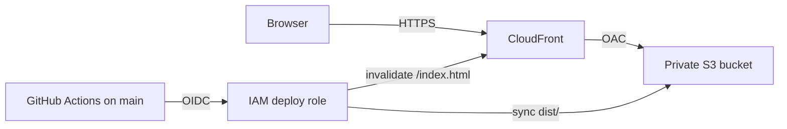

# Deploy

Fluid Tetris is a static Vite app. This hosting path puts `dist/` in a private S3 bucket and serves it with CloudFront over HTTPS. Viewers never talk to the bucket. Amplify is not used.

`npm run build` already emits a site that works at `/`. `vite.config.ts` keeps `base: './'`, which resolves correctly for `/` and `/index.html`. No game code changes are required.

## Architecture



- The bucket blocks all public access, denies non-TLS requests, and uses SSE-S3.
- CloudFront uses Origin Access Control. The bucket policy allows `s3:GetObject` and `s3:ListBucket` only from this distribution. `ListBucket` makes a missing key a real 404. `defaultRootObject` is `index.html`, so `/` does not list the bucket.
- Custom error responses map **403** and **404** to `/index.html` with status **200** and a zero cache TTL, so a refreshed unknown path still loads the app.
- The default behavior uses the managed `CachingDisabled` policy, so `index.html` is not kept at the edge. `/assets/*` uses `CachingOptimized`. Vite fingerprints those files.
- The distribution uses the default `*.cloudfront.net` certificate and redirects HTTP to HTTPS. That certificate's TLS policy is AWS-managed. A stricter minimum needs a custom ACM certificate (see Custom domain). Price class is `PriceClass_200` (North America, Europe, and Asia, including Seoul). HTTP/2 and HTTP/3 are on. Access logs and WAF are off.
- The stack region defaults to `ap-northeast-2` in `infra/cdk.json`. CloudFront itself is global; the bucket is created in the stack region. The CDK CLI's own fallback region does not move this stack.
- The bucket is destroyed with the stack, including its objects. The site can be rebuilt from git. Change `removalPolicy` in `infra/lib/site-stack.ts` if you need to keep the bucket.

## Cost

Ballpark for a personal, low-traffic game after the CloudFront free tier, not a quote. List prices move.

| Piece | What this stack does | Typical low traffic |
| --- | --- | --- |
| CloudFront free tier | 1 TB out and 10 million HTTP/HTTPS requests per month for the first 12 months | Often $0 |
| CloudFront after that | `PriceClass_200`, compress on, no WAF | About $0.12/GB to Asia and about $0.01 per 10,000 HTTPS requests |
| S3 | A few megabytes in Seoul, SSE-S3, no versioning | Cents |
| Invalidations | `/` and `/index.html` each deploy | $0 under 1,000 paths per month |

A few thousand visits a month usually lands around **$1–5 per month** once the free tier ends. There is no NAT gateway, load balancer, or WAF. Adding AWS WAF is several dollars a month by itself, so it is not part of this stack.

## Dry run without AWS credentials

From a checkout, with Node 22:

```bash
cd infra
npm ci
CDK_DEFAULT_ACCOUNT=000000000000 npm run check
```

`npm run check` typechecks the CDK app, synthesizes CloudFormation, and asserts the template (private bucket, OAC, SPA errors, cache policies, GitHub OIDC trust, Seoul region). It does not call AWS. Do not `cdk deploy` the `000000000000` template.

`npm run check` expects the defaults in `infra/cdk.json`. To preview another region without those assertions, run `npx cdk synth -c region=eu-west-1`.

## Bootstrap once

Use an AWS principal that can bootstrap CDK and create S3, CloudFront, IAM, and CloudFormation resources. That is a one-time human deploy, not a GitHub secret.

```bash
export CDK_DEFAULT_ACCOUNT=$(aws sts get-caller-identity --query Account --output text)

cd infra
npm ci
npx cdk bootstrap "aws://${CDK_DEFAULT_ACCOUNT}/ap-northeast-2"
npx cdk deploy
```

The bucket region is the `region` context value, `ap-northeast-2` unless you override it. Bootstrap the same region you deploy to. Another region:

```bash
npx cdk bootstrap "aws://${CDK_DEFAULT_ACCOUNT}/eu-west-1"
npx cdk deploy -c region=eu-west-1
```

`cdk deploy --region` and `CDK_DEFAULT_REGION` do not change this stack. The CLI replaces `CDK_DEFAULT_REGION` with its own resolved region before the app runs, and that fallback is often `us-east-1`. Account precedence is `-c account=...`, then `CDK_DEFAULT_ACCOUNT`.

If the account already has a GitHub OIDC provider for `token.actions.githubusercontent.com`, CloudFormation cannot create a second one. Pass the existing ARN:

```bash
npx cdk deploy \
  -c githubOidcProviderArn=arn:aws:iam::123456789012:oidc-provider/token.actions.githubusercontent.com
```

The deploy role trusts only `repo:HyungSeokSeo1122/fluid-tetris:ref:refs/heads/main`. Another repo is `-c githubRepo=owner/name` **before** the first deploy. The role name is `fluid-tetris-github-deploy`. It can list and write this bucket and create invalidations for this distribution. It cannot change the stack.

## Wire GitHub Actions

No long-lived AWS keys. In the GitHub repository, add **Variables** (Settings → Secrets and variables → Actions → Variables), not secrets:

| Variable | CDK output |
| --- | --- |
| `AWS_DEPLOY_ROLE_ARN` | `AwsDeployRoleArn` |
| `AWS_BUCKET_NAME` | `AwsBucketName` |
| `AWS_DISTRIBUTION_ID` | `AwsDistributionId` |
| `AWS_REGION` | `AwsRegion` (`ap-northeast-2` unless you overrode it) |

`.github/workflows/deploy.yml` does three jobs:

- `build` runs `npm ci` and `npm run build` on pull requests, pushes to `main`, and `workflow_dispatch`.
- `synth` runs the credential-free template check.
- `deploy` runs only for pushes to `main` and `workflow_dispatch`. It assumes the role with GitHub OIDC, syncs `dist/` to the bucket, sets a long cache on hashed files, rewrites `index.html` as `no-cache`, and invalidates `/` and `/index.html`.

The workflow file must be on `main` before a push will deploy. `workflow_dispatch` from any other branch fails the assume-role check, because the trust policy is `refs/heads/main` only. Pull requests do not deploy.

The first successful run needs the four variables. Until they exist, the deploy job stops with the missing names.

## Live URL

After `cdk deploy`, the output `SiteUrl` is the site, for example `https://d111111abcdef8.cloudfront.net`. Distribution creation often takes several minutes. When the CloudFront status is **Deployed**, open that URL.

Later deploys are the GitHub workflow. The hostname stays the same.

## Custom domain

Not created here. To add one later:

1. Request a public ACM certificate in **us-east-1**. CloudFront only sees certificates from that region.
2. Set `domainNames` and `certificate` on the distribution in `infra/lib/site-stack.ts`.
3. Alias the domain at DNS to the CloudFront hostname (Route 53 A/AAAA alias, or a CNAME).

The default `*.cloudfront.net` name can stay in place.

## 한국어

비공개 S3 버킷에 `dist/`를 넣고 CloudFront(OAC)로 HTTPS 서비스합니다. Amplify는 쓰지 않습니다. 기본 리전은 서울(`ap-northeast-2`)입니다.

자격 증명 없이 템플릿만 확인:

```bash
cd infra
npm ci
CDK_DEFAULT_ACCOUNT=000000000000 npm run check
```

실제 적용은 AWS 자격 증명이 있는 쪽에서 한 번만 합니다.

```bash
export CDK_DEFAULT_ACCOUNT=$(aws sts get-caller-identity --query Account --output text)
cd infra && npm ci
npx cdk bootstrap "aws://${CDK_DEFAULT_ACCOUNT}/ap-northeast-2"
npx cdk deploy
```

리전을 바꾸려면 `npx cdk deploy -c region=eu-west-1` 처럼 컨텍스트로 지정하고, 부트스트랩 URI의 리전도 같게 맞춥니다.

스택 출력값을 GitHub Actions **Variables**에 넣습니다. 시크릿에 AWS 액세스 키를 넣지 않습니다.

| 변수 | 출력 |
| --- | --- |
| `AWS_DEPLOY_ROLE_ARN` | 배포 IAM 역할 |
| `AWS_BUCKET_NAME` | 버킷 이름 |
| `AWS_DISTRIBUTION_ID` | CloudFront 배포 ID |
| `AWS_REGION` | 리전 |

`main`에 푸시하거나 workflow를 수동 실행하면 `npm ci && npm run build` 후 버킷에 올리고 `/`와 `/index.html`을 무효화합니다. 사이트 주소는 출력 `SiteUrl`입니다. 트래픽이 적으면 프리 티어 이후에도 보통 월 $1–5 수준입니다.
